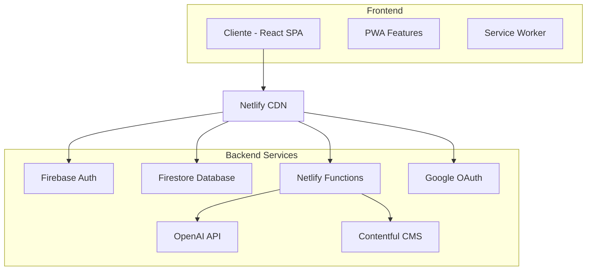
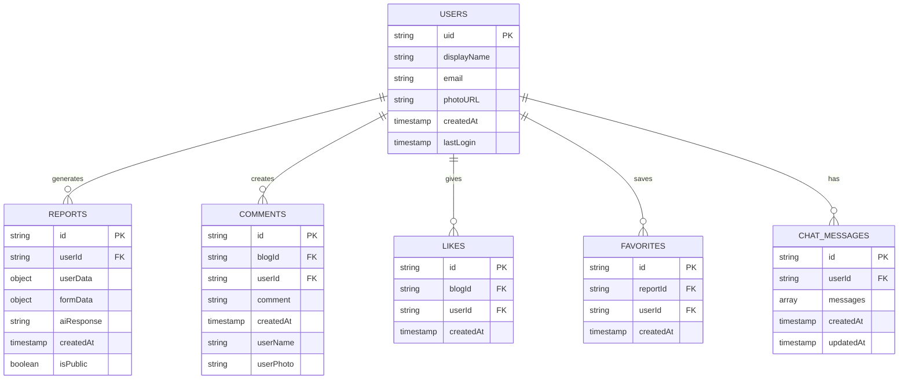

# Documentación Técnica - EGN Fitness

**Asesor de Suplementación Deportiva Personalizada con IA**

---

## 📋 Índice

1. [Arquitectura del Sistema](#arquitectura-del-sistema)
2. [Diagrama de la Base de Datos](#diagrama-de-la-base-de-datos)
3. [Funciones Principales](#funciones-principales)
4. [Estructura de Archivos](#estructura-de-archivos)
5. [Requisitos del Sistema](#requisitos-del-sistema)
6. [Guía de Instalación](#guía-de-instalación)
7. [Configuración y Despliegue](#configuración-y-despliegue)

---

## 🏗️ Arquitectura del Sistema

### Arquitectura General

EGN Fitness utiliza una arquitectura **SPA (Single Page Application)** con **backend serverless** y **base de datos NoSQL**.



### Componentes Principales

#### 1. **Frontend (React SPA)**

- **Framework**: React 18 con TypeScript
- **Estilos**: Tailwind CSS + Styled Components
- **Navegación**: React Router v6
- **Estado**: React Hooks + Context API
- **Internacionalización**: React i18next
- **PWA**: Service Worker + Manifest

#### 2. **Backend Serverless**

- **Hosting**: Netlify
- **Funciones**: Netlify Functions (Node.js)
- **Autenticación**: Firebase Auth
- **Base de datos**: Firestore (NoSQL)
- **CMS**: Contentful (Headless)

#### 3. **Servicios Externos**

- **IA**: OpenAI GPT-3.5
- **OAuth**: Google Sign-In
- **Analytics**: Web Vitals
- **Testing**: Jest + Cypress

---

## 🗄️ Diagrama de la Base de Datos

### Estructura de Firestore



### Colecciones de Firestore

#### 1. **users**

```typescript
interface User {
  uid: string; // ID único de Firebase Auth
  displayName: string; // Nombre del usuario
  email: string; // Email del usuario
  photoURL: string; // URL de la foto de perfil
  createdAt: Timestamp; // Fecha de creación
  lastLogin: Timestamp; // Último login
}
```

#### 2. **reports**

```typescript
interface Report {
  id: string; // ID único del reporte
  userId: string; // ID del usuario que lo generó
  userData: {
    // Datos del usuario
    age: number;
    gender: string;
    weight: number;
    height: number;
  };
  formData: {
    // Respuestas del formulario
    objectives: string[];
    activityLevel: string;
    preferences: string[];
  };
  aiResponse: string; // Respuesta de OpenAI
  createdAt: Timestamp; // Fecha de creación
  isPublic: boolean; // Si es público
}
```

#### 3. **blogComments**

```typescript
interface BlogComment {
  id: string; // ID único del comentario
  blogId: string; // ID del artículo del blog
  comment: string; // Contenido del comentario
  createdAt: Timestamp; // Fecha de creación
  userName: string; // Nombre del usuario
  userPhoto: string; // Foto del usuario
}
```

#### 4. **likes**

```typescript
interface Like {
  id: string; // ID único del like
  blogId: string; // ID del artículo
  userId: string; // ID del usuario
  createdAt: Timestamp; // Fecha del like
}
```

#### 5. **favorites**

```typescript
interface Favorite {
  id: string; // ID único del favorito
  reportId: string; // ID del reporte
  userId: string; // ID del usuario
  createdAt: Timestamp; // Fecha de guardado
}
```

---

## ⚙️ Funciones Principales

### 1. **Autenticación (Firebase Auth)**

#### `signInWithGoogle()`

```typescript
// Función para iniciar sesión con Google
const signInWithGoogle = async () => {
  const provider = new GoogleAuthProvider();
  try {
    const result = await signInWithPopup(auth, provider);
    return result.user;
  } catch (error) {
    console.error('Error signing in with Google:', error);
    throw error;
  }
};
```

#### `signInWithEmail()`

```typescript
// Función para iniciar sesión con email
const signInWithEmail = async (email: string, password: string) => {
  try {
    const result = await signInWithEmailAndPassword(auth, email, password);
    return result.user;
  } catch (error) {
    console.error('Error signing in with email:', error);
    throw error;
  }
};
```

### 2. **Generación de Reportes**

#### `generateReport()`

```typescript
// Función para generar reportes con IA
const generateReport = async (formData: ReportFormData) => {
  try {
    // 1. Validar datos del formulario
    const validatedData = validateFormData(formData);

    // 2. Llamar a la función serverless
    const response = await fetch('/.netlify/functions/openai-chat', {
      method: 'POST',
      headers: { 'Content-Type': 'application/json' },
      body: JSON.stringify({
        messages: [
          {
            role: 'system',
            content: 'Eres un experto en suplementación deportiva...',
          },
          {
            role: 'user',
            content: JSON.stringify(validatedData),
          },
        ],
      }),
    });

    // 3. Guardar en Firestore
    const reportData = {
      userId: auth.currentUser?.uid,
      userData: validatedData.userData,
      formData: validatedData.formData,
      aiResponse: response.data.reply,
      createdAt: Timestamp.now(),
      isPublic: false,
    };

    await addDoc(collection(db, 'reports'), reportData);

    return response.data.reply;
  } catch (error) {
    console.error('Error generating report:', error);
    throw error;
  }
};
```

### 3. **Gestión de Comentarios**

#### `addComment()`

```typescript
// Función para agregar comentarios al blog
const addComment = async (
  blogId: string,
  comment: string,
  user: { displayName: string; photoURL: string }
) => {
  try {
    await addDoc(collection(db, 'blogComments'), {
      blogId,
      comment,
      createdAt: Timestamp.now(),
      userName: user.displayName,
      userPhoto: user.photoURL,
    });
  } catch (error) {
    console.error('Error adding comment:', error);
    throw error;
  }
};
```

#### `getComments()`

```typescript
// Función para obtener comentarios de un blog
const getComments = async (blogId: string): Promise<BlogComment[]> => {
  try {
    const q = query(
      collection(db, 'blogComments'),
      where('blogId', '==', blogId),
      orderBy('createdAt', 'asc')
    );

    const snap = await getDocs(q);
    return snap.docs.map(doc => ({
      id: doc.id,
      blogId,
      comment: doc.data().comment,
      createdAt: doc.data().createdAt?.toDate?.() || new Date(),
      userName: doc.data().userName,
      userPhoto: doc.data().userPhoto,
    }));
  } catch (error) {
    console.error('Error getting comments:', error);
    throw error;
  }
};
```

### 4. **Sistema de Likes y Favoritos**

#### `toggleLike()`

```typescript
// Función para dar/quitar like a un artículo
const toggleLike = async (blogId: string, userId: string) => {
  try {
    const likeRef = doc(db, 'likes', `${blogId}_${userId}`);
    const likeDoc = await getDoc(likeRef);

    if (likeDoc.exists()) {
      // Quitar like
      await deleteDoc(likeRef);
      return false;
    } else {
      // Dar like
      await setDoc(likeRef, {
        blogId,
        userId,
        createdAt: Timestamp.now(),
      });
      return true;
    }
  } catch (error) {
    console.error('Error toggling like:', error);
    throw error;
  }
};
```

### 5. **Funciones Serverless (Netlify Functions)**

#### `openai-chat.ts`

```typescript
// Función serverless para integración con OpenAI
export const handler: Handler = async (event: HandlerEvent) => {
  if (event.httpMethod !== 'POST') {
    return { statusCode: 405, body: 'Method Not Allowed' };
  }

  try {
    const { messages } = JSON.parse(event.body || '{}');

    const completion = await openai.chat.completions.create({
      model: 'gpt-3.5-turbo',
      messages: [
        {
          role: 'system',
          content: 'Eres un experto en suplementación deportiva...',
        },
        ...messages,
      ],
      max_tokens: 1000,
    });

    return {
      statusCode: 200,
      headers: { 'Access-Control-Allow-Origin': '*' },
      body: JSON.stringify({
        reply: completion.choices[0].message.content,
      }),
    };
  } catch (error) {
    return {
      statusCode: 500,
      headers: { 'Access-Control-Allow-Origin': '*' },
      body: JSON.stringify({ error: 'Failed to get response from AI.' }),
    };
  }
};
```

---

## 📁 Estructura de Archivos

```
Fitness/
├── public/                          # Archivos públicos
│   ├── index.html                   # HTML principal
│   ├── manifest.json               # Configuración PWA
│   ├── service-worker.js           # Service Worker
│   └── images/                     # Imágenes estáticas
├── src/                            # Código fuente
│   ├── components/                 # Componentes React
│   │   ├── features/              # Funcionalidades principales
│   │   │   ├── auth/             # Autenticación
│   │   │   ├── ia/               # Inteligencia artificial
│   │   │   ├── pages/            # Páginas principales
│   │   │   └── reports/          # Generación de reportes
│   │   ├── layout/               # Componentes de layout
│   │   └── shared/               # Componentes compartidos
│   ├── services/                 # Servicios y APIs
│   │   ├── aiService.ts          # Servicio de IA
│   │   ├── commentsService.ts    # Servicio de comentarios
│   │   ├── favoritesService.ts   # Servicio de favoritos
│   │   └── likesService.ts       # Servicio de likes
│   ├── config/                   # Configuraciones
│   ├── data/                     # Datos estáticos
│   ├── types/                    # Definiciones TypeScript
│   ├── App.tsx                   # Componente principal
│   └── index.tsx                 # Punto de entrada
├── netlify/                      # Funciones serverless
│   └── functions/
│       └── openai-chat.ts        # Función de OpenAI
├── cypress/                      # Tests E2E
│   └── e2e/
├── documentacion/                # Documentación
│   ├── manual_usuario.md         # Manual de usuario
│   └── documentacion_tecnica.md  # Esta documentación
├── package.json                  # Dependencias
├── tailwind.config.js           # Configuración Tailwind
├── craco.config.js              # Configuración CRACO
├── netlify.toml                 # Configuración Netlify
└── README.md                    # Documentación principal
```

---

## 💻 Requisitos del Sistema

### Requisitos de Desarrollo

#### **Node.js y npm**

- **Node.js**: Versión 16.0.0 o superior
- **npm**: Versión 8.0.0 o superior
- **yarn**: Opcional, versión 1.22.0 o superior

#### **Navegadores Soportados**

- **Chrome**: Versión 90+
- **Firefox**: Versión 88+
- **Safari**: Versión 14+
- **Edge**: Versión 90+

#### **Sistema Operativo**

- **Windows**: 10 o superior
- **macOS**: 10.15 (Catalina) o superior
- **Linux**: Ubuntu 18.04+ o equivalente

### Requisitos de Producción

#### **Servicios Externos**

- **Firebase**: Proyecto configurado con Auth y Firestore
- **OpenAI**: API key válida
- **Contentful**: Space ID y Access Token
- **Google OAuth**: Client ID configurado
- **Netlify**: Cuenta para hosting y funciones

#### **Límites y Cuotas**

- **Firebase**: Plan Spark (gratuito) o superior
- **OpenAI**: Cuota de API según uso
- **Contentful**: Plan gratuito o superior
- **Netlify**: Plan gratuito o superior

---

## 🚀 Guía de Instalación

### 1. **Clonar el Repositorio**

```bash
# Clonar el repositorio
git clone https://github.com/JavierNavarro12/egn-fitness.git
cd egn-fitness

# Instalar dependencias
npm install
```

### 2. **Configurar Variables de Entorno**

Crear archivo `.env.local` en la raíz del proyecto:

```env
# Firebase Configuration
REACT_APP_FIREBASE_API_KEY=tu_api_key
REACT_APP_FIREBASE_AUTH_DOMAIN=tu_auth_domain
REACT_APP_FIREBASE_PROJECT_ID=tu_project_id
REACT_APP_FIREBASE_STORAGE_BUCKET=tu_storage_bucket
REACT_APP_FIREBASE_MESSAGING_SENDER_ID=tu_sender_id
REACT_APP_FIREBASE_APP_ID=tu_app_id
REACT_APP_FIREBASE_VAPID_KEY=tu_vapid_key

# OpenAI Configuration
OPENAI_API_KEY=tu_openai_key

# Contentful Configuration
REACT_APP_CONTENTFUL_SPACE_ID=tu_contentful_space_id
REACT_APP_CONTENTFUL_ACCESS_TOKEN=tu_contentful_access_token
REACT_APP_CONTENTFUL_ENVIRONMENT=master

# Google OAuth
REACT_APP_GOOGLE_CLIENT_ID=tu_google_client_id
```

### 3. **Configurar Firebase**

1. Crear proyecto en [Firebase Console](https://console.firebase.google.com/)
2. Habilitar Authentication con Google y Email/Password
3. Crear base de datos Firestore
4. Configurar reglas de seguridad
5. Obtener credenciales de configuración

### 4. **Configurar OpenAI**

1. Crear cuenta en [OpenAI](https://openai.com/)
2. Generar API key
3. Configurar cuotas y límites

### 5. **Configurar Contentful**

1. Crear cuenta en [Contentful](https://www.contentful.com/)
2. Crear Space para el blog
3. Configurar Content Types
4. Obtener Space ID y Access Token

### 6. **Configurar Google OAuth**

1. Ir a [Google Cloud Console](https://console.cloud.google.com/)
2. Crear proyecto o usar existente
3. Habilitar Google+ API
4. Crear credenciales OAuth 2.0
5. Configurar URIs autorizados

### 7. **Ejecutar en Desarrollo**

```bash
# Ejecutar servidor de desarrollo
npm start

# Abrir en navegador
# http://localhost:3000
```

### 8. **Construir para Producción**

```bash
# Construir aplicación
npm run build

# Probar build localmente
npx serve -s build
```

---

## ⚙️ Configuración y Despliegue

### Despliegue en Netlify

#### **Opción 1: Despliegue Automático (Recomendado)**

1. Conectar repositorio GitHub a Netlify
2. Configurar variables de entorno en Netlify
3. Configurar dominio personalizado (opcional)
4. Activar funciones serverless

#### **Opción 2: Despliegue Manual**

```bash
# Instalar Netlify CLI
npm install -g netlify-cli

# Login en Netlify
netlify login

# Inicializar proyecto
netlify init

# Desplegar
netlify deploy --prod
```

### Configuración de Netlify

#### **netlify.toml**

```toml
[build]
  command = "npm install --legacy-peer-deps && npm run build"
  publish = "build"

[functions]
  directory = "netlify/functions"
  node_bundler = "esbuild"

[functions."openai-chat"]
  timeout = 25

[[headers]]
  for = "/*"
  [headers.values]
    Content-Security-Policy = "default-src 'self'; script-src 'self' 'unsafe-inline' 'unsafe-eval' https://accounts.google.com; style-src 'self' 'unsafe-inline' https://fonts.googleapis.com;"
    X-Frame-Options = "DENY"
    X-Content-Type-Options = "nosniff"
```

### Configuración de Firebase

#### **Reglas de Firestore**

```javascript
rules_version = '2';
service cloud.firestore {
  match /databases/{database}/documents {
    // Usuarios pueden leer/escribir sus propios datos
    match /users/{userId} {
      allow read, write: if request.auth != null && request.auth.uid == userId;
    }

    // Reportes: usuarios pueden crear/leer sus propios reportes
    match /reports/{reportId} {
      allow read, write: if request.auth != null &&
        request.auth.uid == resource.data.userId;
    }

    // Comentarios: usuarios autenticados pueden crear/leer
    match /blogComments/{commentId} {
      allow read: if true;
      allow create: if request.auth != null;
    }

    // Likes: usuarios autenticados pueden crear/eliminar
    match /likes/{likeId} {
      allow read, write: if request.auth != null;
    }
  }
}
```

### Configuración de PWA

#### **manifest.json**

```json
{
  "short_name": "EGN Fitness",
  "name": "EGN Fitness - Asesor de Suplementación",
  "icons": [
    {
      "src": "logo-192.png",
      "sizes": "192x192",
      "type": "image/png"
    },
    {
      "src": "logo-512.png",
      "sizes": "512x512",
      "type": "image/png"
    }
  ],
  "start_url": ".",
  "display": "standalone",
  "theme_color": "#000000",
  "background_color": "#ffffff"
}
```

### Monitoreo y Analytics

#### **Web Vitals**

```typescript
// src/reportWebVitals.ts
import { ReportHandler } from 'web-vitals';

const reportWebVital = (onPerfEntry?: ReportHandler) => {
  if (onPerfEntry && onPerfEntry instanceof Function) {
    import('web-vitals').then(({ getCLS, getFID, getFCP, getLCP, getTTFB }) => {
      getCLS(onPerfEntry);
      getFID(onPerfEntry);
      getFCP(onPerfEntry);
      getLCP(onPerfEntry);
      getTTFB(onPerfEntry);
    });
  }
};

export default reportWebVital;
```

---

## 🔧 Mantenimiento y Actualizaciones

### Scripts Disponibles

```bash
# Desarrollo
npm start              # Servidor de desarrollo
npm run build          # Construir para producción
npm test               # Ejecutar tests unitarios
npm run test:e2e       # Ejecutar tests E2E
npm run test:all       # Ejecutar todos los tests

# Calidad de código
npm run lint           # Análisis de código
npm run lint:fix       # Corregir problemas automáticamente
npm run format         # Formatear código
npm run type-check     # Verificar tipos TypeScript

# Despliegue
npm run deploy         # Desplegar a Netlify
```

### Actualizaciones de Dependencias

```bash
# Verificar dependencias desactualizadas
npm outdated

# Actualizar dependencias
npm update

# Actualizar a versiones más recientes
npx npm-check-updates -u
npm install
```

### Backup y Recuperación

#### **Backup de Firestore**

```bash
# Exportar datos de Firestore
firebase firestore:export ./backup

# Importar datos a Firestore
firebase firestore:import ./backup
```

---

## 📊 Métricas y Rendimiento

### Lighthouse Scores Objetivo

- **Performance**: 90+
- **Accessibility**: 95+
- **Best Practices**: 95+
- **SEO**: 90+

### Métricas de Core Web Vitals

- **LCP (Largest Contentful Paint)**: < 2.5s
- **FID (First Input Delay)**: < 100ms
- **CLS (Cumulative Layout Shift)**: < 0.1

### Monitoreo Continuo

- **Netlify Analytics**: Métricas de rendimiento
- **Firebase Analytics**: Comportamiento de usuarios
- **Error Tracking**: Monitoreo de errores en producción

---

_Esta documentación se actualiza regularmente. Para la versión más reciente, consulta el repositorio del proyecto._
